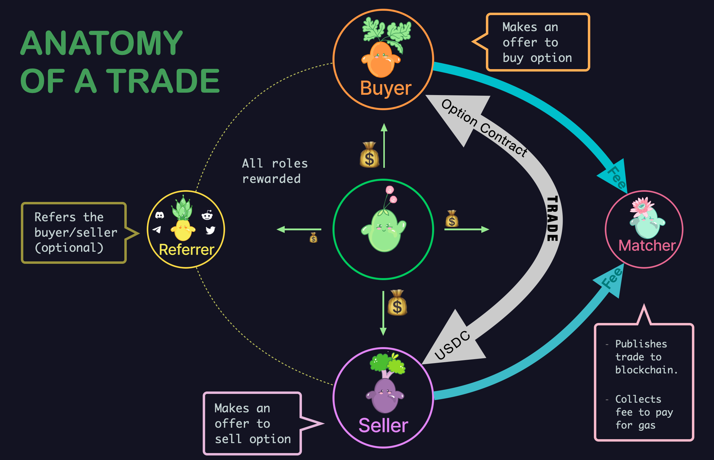

# Incentives

# &nbsp;

Shrub will incentivize all of the value providers on the platform. By using Shrub users will be rewarded. Rewards will be offered to the following roles \(in order\):

* Market Maker - Creates limit orders in the vicinity of the market price to fill the order book
* Buyer - Purchases options
* Matcher - publishes the match transaction on the blockchain \(this role can also be played by the buyer\)
* Referrer - Third-party referring the trade

